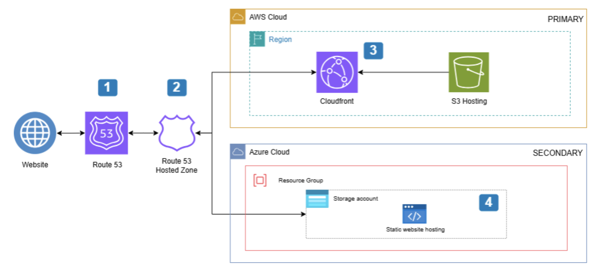

# 🌦️ Multi-Cloud Weather Tracker with Disaster Recovery

A static weather tracking web application deployed across AWS and Azure, with automated DNS failover for disaster recovery — fully provisioned using Terraform.

---

## Problem Statement

I wanted to go beyond single-cloud projects and understand how real production systems stay online when one cloud provider has an outage. Disaster recovery is something I kept hearing about in consulting engagements but had never actually built myself. This project gave me a reason to get hands-on with multi-cloud infrastructure — hosting a weather app across both AWS and Azure, and using Route 53 DNS failover to automatically reroute traffic if the primary endpoint goes down. I also used Terraform to provision everything, which pushed me to think about infrastructure as code rather than clicking through consoles.

---

## Architecture Diagram



---

## Architecture Walkthrough

1. **DNS Resolution** — When a user enters the website domain in their browser, the DNS request is routed to **Amazon Route 53**, which holds the DNS records for the domain registered via Namecheap.
2. **Failover Routing** — The **Route 53 Hosted Zone** stores routing rules for the primary and secondary endpoints. It continuously runs health checks and directs traffic to either the AWS or Azure infrastructure depending on which endpoint is healthy.
3. **Primary Hosting (AWS)** — The weather app's front-end (HTML, CSS, JS) is hosted statically on **Amazon S3** and served globally via **AWS CloudFront** as a CDN, reducing latency for users regardless of location.
4. **Secondary Hosting (Azure)** — If the primary AWS endpoint fails, Route 53 automatically reroutes traffic to the secondary endpoint — a static website hosted on **Azure Blob Storage** within an Azure Storage Account, grouped under an Azure Resource Group.
5. **Infrastructure as Code** — The entire multi-cloud infrastructure across both AWS and Azure is defined and provisioned using **Terraform**, enabling repeatable and automated deployments.

---

## Services Used

| Service | Purpose |
| --- | --- |
| Amazon S3 | Host the weather app statically as the primary endpoint |
| AWS CloudFront | Distribute static content globally via CDN |
| Amazon Route 53 | DNS management and automated failover between AWS and Azure |
| Azure Blob Storage | Host the weather app statically as the secondary failover endpoint |
| Azure Storage Account | Container for Azure Blob Storage and static website hosting |
| Namecheap | Domain registration and DNS configuration with Route 53 |
| Terraform | Automate provisioning of all infrastructure across both clouds |

---

## Well-Architected Framework Alignment

**Reliability**
- Route 53 health checks continuously monitor the primary AWS endpoint and automatically failover to Azure Blob Storage if it becomes unhealthy — ensuring the application remains available even during a regional AWS outage.
- Hosting on two separate cloud providers eliminates single-cloud dependency, the strongest form of redundancy for availability.

**Performance Efficiency**
- CloudFront CDN caches and serves static assets from edge locations closest to the user, reducing latency regardless of geographic location.

**Cost Optimization**
- Hosting a static front-end on S3 and Azure Blob Storage avoids the cost of running compute instances (EC2, VMs) for a workload that has no server-side logic.
- Terraform eliminates manual provisioning effort and reduces the risk of configuration drift that leads to unnecessary resources being left running.

**Security**
- CloudFront sits in front of S3, meaning the S3 bucket itself does not need to be publicly accessible — content is served only through the CDN.
- IAM roles and Azure RBAC are used to scope access to only what each service requires.

**Operational Excellence**
- The entire infrastructure is defined in Terraform, making it version-controlled, auditable, and repeatable across environments.
- Route 53 failover is automated — no manual intervention is required to reroute traffic during an outage.

---

## Key Design Decisions & Trade-offs

**Multi-cloud over multi-region AWS**
Disaster recovery could have been achieved by hosting the secondary endpoint in a second AWS region. A second cloud provider was chosen instead because it protects against AWS-wide outages and demonstrates genuine multi-cloud architecture. Trade-off: managing two cloud providers introduces more complexity and requires familiarity with both AWS and Azure tooling.

**Static hosting over compute**
The weather app front-end is purely static (HTML, CSS, JS), so there is no need for a web server or compute instance. S3 and Azure Blob Storage handle static hosting natively at a fraction of the cost. Trade-off: any server-side logic would require a separate compute layer.

**Route 53 for DNS failover over Azure Traffic Manager**
Route 53 was chosen as the single DNS management layer because the domain is registered via Namecheap and the primary infrastructure is on AWS. Route 53 health checks natively support failover routing to external endpoints including Azure, making it the simplest and most cost-effective choice. Trade-off: Route 53 is an AWS service, so if AWS DNS infrastructure itself were to fail, failover could be impacted.

**Terraform over console provisioning**
All infrastructure is provisioned via Terraform rather than manually through the AWS and Azure consoles. This ensures the setup is reproducible, version-controlled, and not dependent on remembering manual steps. Trade-off: Terraform requires upfront learning and state management, which adds complexity for a small project but pays off significantly at scale.

---

## Screenshots

- Python Script Running:
  
   
  
- Kinesis Data Streams console showing incoming records:
  
   
   
  
- Lambda invocation logs in CloudWatch
  
    
    
  
- Athena query results against S3 data
  
     
     
   
- SNS alert email/SMS received
  
    

---

---

## Lessons Learned & What I'd Improve

**What I'd add next:**
- **Azure Traffic Manager** — Adding Azure Traffic Manager as a secondary DNS layer would provide true bidirectional failover, protecting against failures on either cloud independently.
- **CloudFront invalidation automation** — Automate cache invalidation via a Lambda function or CI/CD pipeline when the front-end is updated, rather than doing it manually.
- **Terraform remote state** — Move Terraform state to an S3 backend with DynamoDB locking for state management, rather than storing it locally. This is the production standard for team environments.
- **CI/CD pipeline** — Add a GitHub Actions workflow to automatically run `terraform plan` and `terraform apply` on push, turning infrastructure changes into a proper deployment pipeline.

**What I learned:**
- Route 53 can route traffic to external endpoints outside of AWS — including Azure — using health checks and failover routing policies. This makes it a viable single DNS layer for multi-cloud architectures.
- Terraform's provider model means you can provision resources across AWS and Azure in the same codebase, which significantly reduces the complexity of managing multi-cloud infrastructure.
- Static website hosting on both S3 and Azure Blob Storage requires specific configuration — S3 needs a bucket policy for public access and website hosting enabled, while Azure requires the `$web` container and static website feature enabled on the storage account.
- CDN behaviour means that after a failover, cached content may still be served from CloudFront edge locations briefly — TTL and cache invalidation strategy matters for disaster recovery.

---

## Repo Structure

```
multi-cloud-weather-tracker/
├── README.md
├── architecture/
│   ├── diagram.png
│   └── diagram.drawio
├── src/
│   ├── index.html
│   ├── style.css
│   └── app.js
├── terraform/
│   ├── aws/
│   │   ├── main.tf
│   │   ├── variables.tf
│   │   └── outputs.tf
│   └── azure/
│       ├── main.tf
│       ├── variables.tf
│       └── outputs.tf
├── docs/
│   └── decisions.md
└── screenshots/
```
